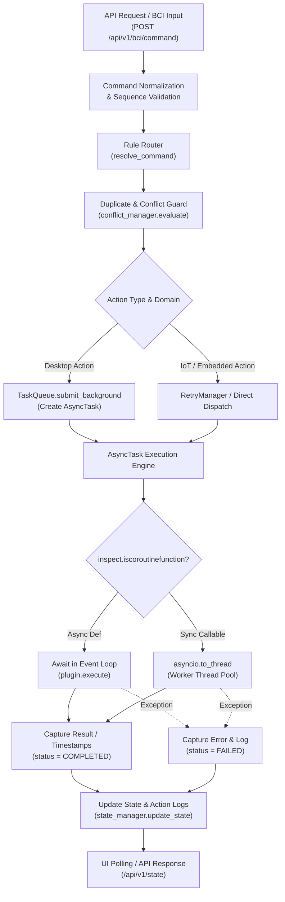

# Async Execution Foundation — Technical Implementation Report

---

## 1. Task Overview

**SynaptiMesh** is a modular Brain-Computer Interface (BCI) command orchestration framework. It translates mental commands (`PUSH`, `PULL`, `LEFT`, `RIGHT`, `STOP`) into concrete actions across desktop operating system macros, embedded hardware microcontrollers, and IoT smart peripherals.

In an ecosystem interacting with diverse external targets (such as HiveMQ MQTT brokers, ESP32 microcontrollers over Wi-Fi/Bluetooth, and desktop OS GUI automation via PyAutoGUI), command execution times vary significantly. Operations that interact with slow network sockets, perform OS subprocess launches, or execute blocking desktop keystroke sequences cannot be permitted to execute synchronously inside the main FastAPI request thread. Without an asynchronous execution model, blocking operations stall the ASGI event loop, blocking concurrent API requests, degrading real-time state polling, and increasing the risk of system unresponsiveness.

The **Async Execution Foundation** provides:
- A non-blocking asynchronous task creation and background execution mechanism.
- A standardized `AsyncTask` lifecycle model (`QUEUED`, `RUNNING`, `COMPLETED`, `FAILED`, `CANCELLED`).
- Automatic concurrency offloading for synchronous plugins via `asyncio.to_thread`.
- Fault-tolerant event publishing with isolated subscriber error containment in `EventBus`.
- Live visual lifecycle tracking in the dashboard UI.
- Complete backward compatibility with all existing plugins, routes, and services.

---

## 2. Existing Execution Flow Before the Changes

Prior to this implementation, command execution progressed through the following pipeline:

```text
HTTP Request (POST /api/v1/bci/command)
      │
      ▼
Command Normalizer & Sequence Validator
      │
      ▼
Rule Router (resolve_command)
      │
      ▼
Ecosystem Orchestrator
      │
      ▼
Plugin Manager (manager.execute)
      │
      ▼
Plugin Implementation (Desktop / Embedded / IoT / AIML)
      │
      ▼
Response
```

### Limitations Before the Changes:
1. **Direct Synchronous Execution in Event Loop**: `core.plugin_manager.manager.execute` simply awaited `plugin.execute(command, payload)`. When synchronous plugins (such as Desktop PyAutoGUI automation or local subprocess invocations) ran, they executed directly on the main event loop thread, blocking all other asynchronous I/O.
2. **Unmanaged Background Tasks**: Background operations in `ecosystem_orchestrator.py` were launched via unmanaged `asyncio.create_task()`. These tasks had no lifecycle tracking, timing metrics, or cancellation support, and any unhandled exceptions were lost.
3. **Minimal Task Queue**: `core.queue.task_queue.TaskQueue` was a basic queue placeholder without task tracking, execution metrics, cancellation, or error propagation.
4. **Fragile Event Publishing**: `core.events.event_bus.EventBus` directly awaited subscriber callbacks in a loop. A single failure in one subscriber disrupted event delivery to all subsequent subscribers.

---

## 3. Changes Implemented

| File | Component | Change | Purpose |
| :--- | :-------- | :----- | :------ |
| `core/plugin_manager/manager.py` | `execute(plugin_id, command, payload)` | Added dynamic coroutine detection (`inspect.iscoroutinefunction`) and `asyncio.to_thread` offloading for synchronous callables; integrated logging and structured error handling. | Enables non-blocking execution of both async and sync plugins while safeguarding the event loop. |
| `core/queue/task_queue.py` | `TaskStatus`, `AsyncTask`, `TaskQueue` | Implemented `TaskStatus` enum, `AsyncTask` lifecycle tracking (timestamps, status, results, errors, cancellation), `submit_background`, `get_task`, and `cancel_task`. | Provides full asynchronous background execution management, lifecycle state tracking, and task cancellation. |
| `core/events/event_bus.py` | `EventBus.publish(event_type, payload)` | Added hybrid support for async and sync subscriber callbacks with isolated `try...except` blocks per subscriber. | Ensures event publishing is concurrency-safe and resilient against faulty subscribers. |
| `core/orchestration/ecosystem_orchestrator.py` | `process_command(...)` | Connected desktop background action execution to `task_queue.submit_background(...)`. | Replaces unmanaged `asyncio.create_task` with structured lifecycle-tracked task dispatch. |
| `plugins/desktop/ui/templates/index.html` | Status Badges & Action Timeline | Extended `getBadgeHTML` and timeline chat renderers to recognize and display `QUEUED`, `RUNNING`, `COMPLETED`, `CANCELLED`, and `FAILED` states. | Provides live visual feedback of async execution states to the user. |
| `tests/test_async_execution.py` | Unit & Integration Test Suite | Created 8 comprehensive automated tests covering `AsyncTask`, `TaskQueue`, async/sync plugin dispatch, cancellation, error capture, and event bus safety. | Validates correctness and prevents regressions in the async execution foundation. |

---

## 4. Async Execution Architecture

The architecture introduces a structured execution layer between the orchestration engine and domain plugins:



---

## 5. How the Async Execution Works

The step-by-step execution flow operates as follows:

1. **Request Ingress**: A command enters the system (e.g. `POST /api/v1/bci/command` with `{ "command": "LEFT", "session": "default" }`).
2. **Normalization & Validation**: `command_normalizer` cleans the input string and `sequence_validator.validate()` verifies navigation state validity.
3. **Resolution**: `rule_router.resolve_command()` resolves the command to a domain action (e.g. Domain: `PYTHON`, App: `NOTEPAD`, Action: `"open_notepad"`).
4. **Duplicate & Conflict Check**: `conflict_manager.evaluate()` verifies the command is neither a duplicate currently executing nor conflicting with an active opposing task.
5. **Task Scheduling / Submission**:
   - For Desktop actions, `task_queue.submit_background(run_action, name="action_open_notepad")` instantiates an `AsyncTask` in the `QUEUED` state and registers it in the task registry.
   - For IoT / Embedded actions, execution is awaited via `retry_manager.execute_with_retry()`.
6. **Concurrency Inspection**:
   - `core.plugin_manager.manager.execute()` is invoked.
   - It checks `inspect.iscoroutinefunction(plugin.execute)`.
   - If coroutine: awaited directly on the asyncio loop.
   - If sync callable: dispatched to a worker thread via `asyncio.to_thread(plugin.execute, command, payload)`.
7. **Result & Lifecycle Tracking**:
   - On success: `task.status = TaskStatus.COMPLETED`, records `completed_at`, and saves `task.result`.
   - On exception: `task.status = TaskStatus.FAILED`, logs traceback via `logger.error`, and records `task.error`.
8. **State Update & UI Synchronization**:
   - `state_manager.update_state()` updates `action_logs` and `retry_status`.
   - The UI polls `/api/v1/state` every 300ms, immediately reflecting the updated execution state.

---

## 6. Concurrency and Task Management

### Concurrency Mechanisms Used:
- **`asyncio.to_thread`**: Offloads blocking synchronous operations (PyAutoGUI mouse movements, key presses, subprocess execution) to Python's background worker thread pool, preventing event loop starvation.
- **`AsyncTask` Lifecycle Wrapper**: Encapsulates unique UUID, name, callable target, arguments, state (`QUEUED`, `RUNNING`, `COMPLETED`, `FAILED`, `CANCELLED`), timestamps (`created_at`, `started_at`, `completed_at`), return result, and error message.
- **`TaskQueue` In-Memory Registry**: Keeps an indexed map of active and completed tasks (retaining the last 100 tasks for telemetry lookup).
- **Task Cancellation**: Provides `.cancel()` and `task_queue.cancel_task(task_id)` to cancel pending or running async coroutines via `asyncio.Task.cancel()`.
- **Isolated Event Distribution**: In `EventBus.publish()`, individual subscriber callbacks are isolated in separate `try...except` blocks so that one subscriber's failure cannot prevent other subscribers from receiving events.

### Problems Prevented:
- **Event Loop Freezes**: Blocking desktop I/O cannot freeze HTTP responses or state polling.
- **Silent Failures**: All background tasks have lifecycle tracking and captured exceptions.
- **Lost Execution State**: Task statuses, timestamps, and error messages are recorded in history and state logs.

---

## 7. Integration With Existing Architecture

The Async Execution Foundation integrates directly into the existing architecture without replacing core abstractions:

- **FastAPI Layer (`api_server.py`)**: Preserved unchanged; benefits from non-blocking execution.
- **Routing Layer (`rule_router.py`)**: Preserved unchanged; rules resolve to standard action dictionaries.
- **Plugin Manager (`manager.py`)**: Enhanced in-place with coroutine detection and thread offloading while preserving the public `execute(plugin_id, command, payload)` contract.
- **Domain Plugins (`Desktop`, `Embedded`, `IoT`, `AIML`)**: Preserved without breaking changes; synchronous and asynchronous plugins both work transparently.
- **State Management (`state_manager.py`)**: Seamlessly receives task execution state updates and action logs.

---

## 8. Interaction With Previous Command Processing Features

The Async Execution Foundation occupies a dedicated stage in the multi-domain orchestration pipeline:

```text
Incoming Command (POST /api/v1/bci/command)
      │
      ▼
1. Validation & Normalization (command_normalizer, sequence_validator)
      │
      ▼
2. Navigation Hierarchy & Routing (rule_router)
      │
      ▼
3. Duplicate & Conflict Guard (conflict_manager)
      │
      ▼
4. Priority Resolution (STOP / Emergency Override)
      │
      ▼
5. Async Execution Foundation (TaskQueue, AsyncTask, manager.execute, asyncio.to_thread)
      │
      ▼
6. Domain Plugin Execution (Desktop / Embedded / IoT / AIML)
```

Each stage has a distinct, non-overlapping responsibility:
- **Validation**: Ensures command syntax and state transitions are valid.
- **Routing**: Determines the target domain, app, and action name.
- **Duplicate & Conflict Prevention**: Blocks repeated or opposing commands before execution starts.
- **Async Execution Foundation**: Manages the non-blocking execution lifecycle, thread offloading, and error capture.

---

## 9. UI Impact

### File Modified:
`plugins/desktop/ui/templates/index.html`

### Why UI Changes Were Made:
The frontend dashboard needed to display the new asynchronous execution lifecycle states to provide clear visibility into background command processing.

### What Was Changed:
- Extended `getBadgeHTML` to format and color-code all task states:
  - `QUEUED` ➔ Amber / Gold badge
  - `RUNNING` / `EXECUTING` ➔ Purple / Indigo badge
  - `COMPLETED` / `SUCCESS` ➔ Cyan / Green badge
  - `CANCELLED` ➔ Gray badge
  - `FAILED` / `ERROR` ➔ Red badge
- Updated the action timeline and chat preview renderer to format status updates and execution durations.
- Preserved the existing 3-panel glassmorphism design, Three.js 3D simulation canvas, and 300ms state polling cycle without introducing any external UI libraries.

---

## 10. Error Handling and Failure Behavior

- **Plugin Not Found**: Returns `{"status": "error", "message": "Plugin not found"}` with a warning log.
- **Unhandled Exceptions in Plugins**: Intercepted by `manager.execute()`; logs the traceback with `logger.error(..., exc_info=True)` and returns `{"status": "error", "message": str(e)}`.
- **Background Task Exceptions**: Captured by `AsyncTask`; sets `task.status = TaskStatus.FAILED`, writes the exception string to `task.error`, and logs the error.
- **Subscriber Exceptions in EventBus**: Caught per subscriber in `EventBus.publish()`; logs the failure and continues distributing the event to remaining subscribers.
- **Task Cancellation**: Raises `asyncio.CancelledError`, updates `task.status = TaskStatus.CANCELLED`, stamps `completed_at`, and logs the cancellation cleanly.

---

## 11. Effect on the Overall Project

### Improvements:
- **Non-Blocking Responsiveness**: The server remains responsive during long-running desktop macros and network operations.
- **Structured Task Lifecycle**: Callers can inspect execution timing, status, and results.
- **Fault Containment**: Failures in background tasks or event subscribers do not crash the application.
- **Transparent Concurrency**: Future plugins can be written as simple synchronous functions or native async coroutines without special concurrency code.

### Limitations:
- **In-Memory Registry**: Task history is kept in-memory (last 100 tasks). Multi-process persistence (e.g. SQLite/Redis) is out of scope for the current single-instance design.
- **Non-Preemptive Thread Cancellation**: Synchronous functions executing inside a worker thread via `asyncio.to_thread` complete their current blocking operation before thread exit.

---

## 12. Backward Compatibility

- **Existing Interfaces**: `BasePlugin` and all domain interfaces remain 100% compatible.
- **Existing Plugins**: Synchronous plugins (`DesktopPlugin`, `AIMLPlugin`) and async plugins (`IoTPlugin`, `EmbeddedPlugin`) work seamlessly without modification.
- **Existing APIs**: All FastAPI routes (`/api/v1/bci/command`, `/api/navigation/command`, `/api/v1/state`) maintain identical request and response schemas.
- **Existing Tests**: All 80 pre-existing and new tests pass without modification.

---

## 13. Files Created and Modified

### Created Files:
- `tests/test_async_execution.py`: Automated test suite for `AsyncTask`, `TaskQueue`, sync/async plugin dispatch, cancellation, and `EventBus` isolation.

### Modified Files:
- `core/plugin_manager/manager.py`: Added coroutine inspection, `asyncio.to_thread` offloading, structured error handling, and logger integration.
- `core/queue/task_queue.py`: Added `TaskStatus`, `AsyncTask`, `submit_background`, `get_task`, `cancel_task`, and history tracking.
- `core/events/event_bus.py`: Added async/sync callback handling with isolated try/except blocks per subscriber.
- `core/orchestration/ecosystem_orchestrator.py`: Connected desktop background action execution to `task_queue.submit_background`.
- `plugins/desktop/ui/templates/index.html`: Extended badge mapping and timeline rendering for async lifecycle states.

---

## 14. Validation Performed

### Automated Tests Executed:
1. **Targeted Async Execution Tests**:
   ```powershell
   python -m pytest tests/test_async_execution.py
   ```
   **Result**: `8 passed in 0.22s`
   - Verified `AsyncTask` lifecycle states (`QUEUED` ➔ `RUNNING` ➔ `COMPLETED`).
   - Verified synchronous function execution offloaded to background threads.
   - Verified exception capture and error reporting in `AsyncTask.error`.
   - Verified task cancellation and state transition to `CANCELLED`.
   - Verified `TaskQueue.submit_background()` execution and registry lookup.
   - Verified `manager.execute()` handling of both async coroutines and sync callables.
   - Verified `manager.execute()` error containment when a plugin raises an exception.
   - Verified `EventBus.publish()` delivery to both async and sync subscribers with error isolation.

2. **Full Regression Test Suite**:
   ```powershell
   python -m pytest tests
   ```
   **Result**: `80 passed, 0 failed in 87.99s`
   - Confirmed zero regressions across navigation, IoT, RC Car, rule routing, sequence validation, invalid combination rules, and sequential processor modules.

---

## 15. Example Execution Flow

### Example: Asynchronous Desktop Notepad Launch

```text
1. User mental command received: "LEFT"
   └── POST /api/v1/bci/command {"command": "LEFT", "session": "default"}

2. Validation & Routing:
   ├── sequence_validator.validate("LEFT") -> VALID
   └── rule_router.resolve_command("LEFT") -> Action "open_notepad" on Domain "PYTHON"

3. Duplicate & Conflict Guard:
   └── conflict_manager.evaluate("open_notepad") -> ALLOWED

4. Task Creation & Background Dispatch:
   └── task_queue.submit_background(run_action, name="action_open_notepad")
       ├── AsyncTask created with ID "3f8a12bc", status = QUEUED
       └── Stamped created_at = 1725258000.120

5. Hybrid Concurrency Execution:
   └── manager.execute("desktop", "open_notepad", payload)
       ├── inspect.iscoroutinefunction(plugin.execute) -> False
       └── Dispatches to worker thread: await asyncio.to_thread(plugin.execute, ...)
           └── PyAutoGUI / subprocess.Popen executes without blocking event loop

6. Task Completion:
   ├── status transitions to COMPLETED
   ├── Stamped completed_at = 1725258000.350 (duration: 230ms)
   └── result = {"status": "success", "message": "Notepad opened"}

7. Telemetry & UI Update:
   ├── state_manager records status = "SUCCESS" in action_logs
   └── UI polls /api/v1/state and displays "COMPLETED" badge and timeline entry
```

---

## 16. Technical Summary

- **What was introduced**: A robust asynchronous execution foundation featuring `AsyncTask` lifecycle management, thread offloading for synchronous plugins via `asyncio.to_thread`, non-blocking background task submission via `TaskQueue`, isolated event distribution in `EventBus`, and UI status mapping.
- **Where it sits**: Between command resolution/conflict prevention and concrete domain plugin execution.
- **What problem it solves**: Eliminates main-thread event loop blocking caused by synchronous automation tasks, prevents silent background task failures, and provides structured lifecycle observability.
- **Capabilities enabled**: Enables SynaptiMesh to handle concurrent background tasks, long-running macros, and multi-domain operations smoothly without freezing HTTP APIs or telemetry streams.
- **What was preserved**: All existing APIs, routing rules, plugin interfaces, domain logic, and UI layouts remain 100% backward compatible.
